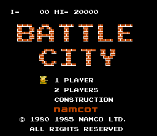

# Battle City NES - Phaser & Vite



Este es un proyecto de recreación del clásico juego _Battle City_ de NES, desarrollado utilizando [Phaser](https://phaser.io/) y empaquetado con [Vite](https://vitejs.dev/). Este proyecto es un ejercicio para probar y aprender sobre el motor de juegos Phaser y el bundler Vite.

## Demo

Puedes probar el juego en vivo [aquí](https://battle-city-nes-phaser.vercel.app/)

## Características

- 🎮 Juego clásico de _Battle City_ recreado.
- 💻 Desarrollo rápido con Vite.
- 🎨 Gráficos y sonidos nostálgicos.
- 🔥 Animaciones y físicas manejadas con Phaser.
- 🚀 Código modular y mantenible.

## Instalación

1. Clona el repositorio:

   ```bash
   git clone https://github.com/RubenMeju/Battle_city_nes_vite_phaser.git
   cd battle-city-phaser
   ```

2. Instala las dependencias:

   ```bash
   npm install
   ```

   o si prefieres usar `yarn`:

   ```bash
   yarn install
   ```

## Uso

Para ejecutar el proyecto en modo de desarrollo:

```bash
npm run dev
```
